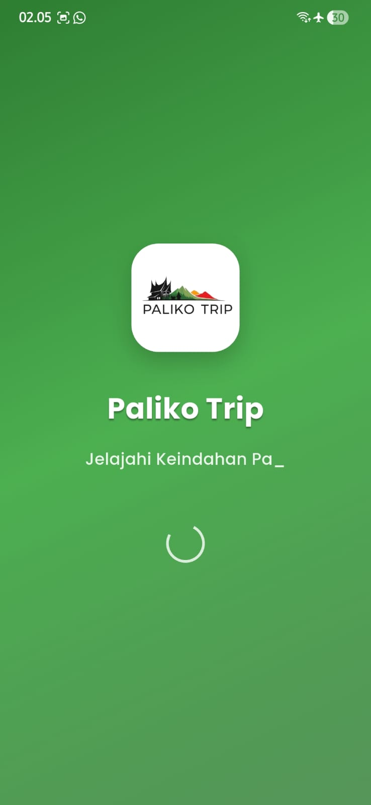
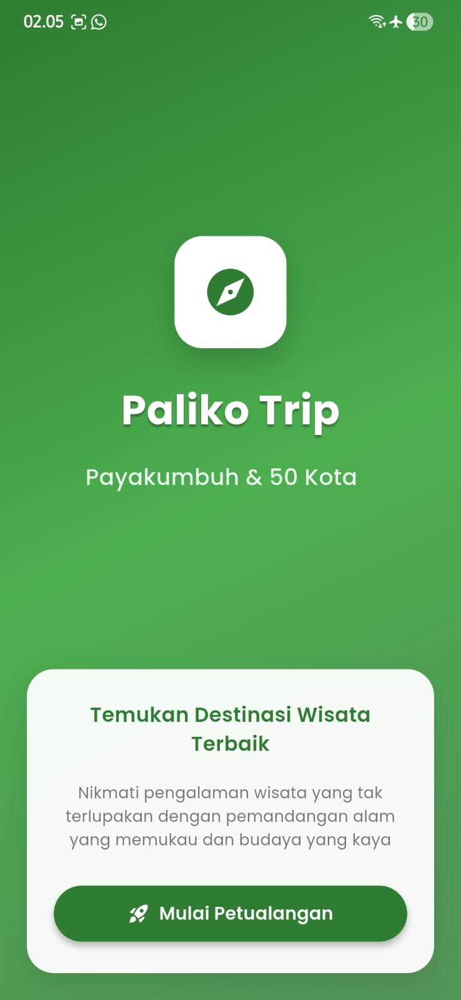
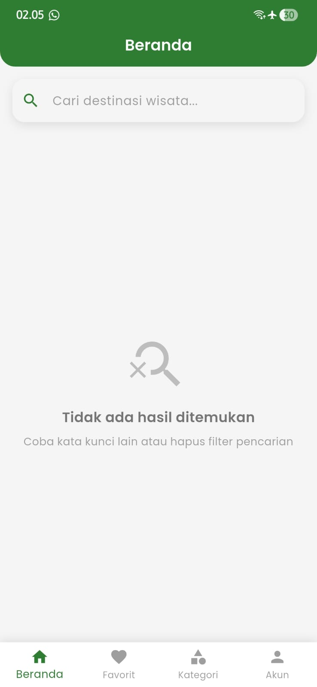
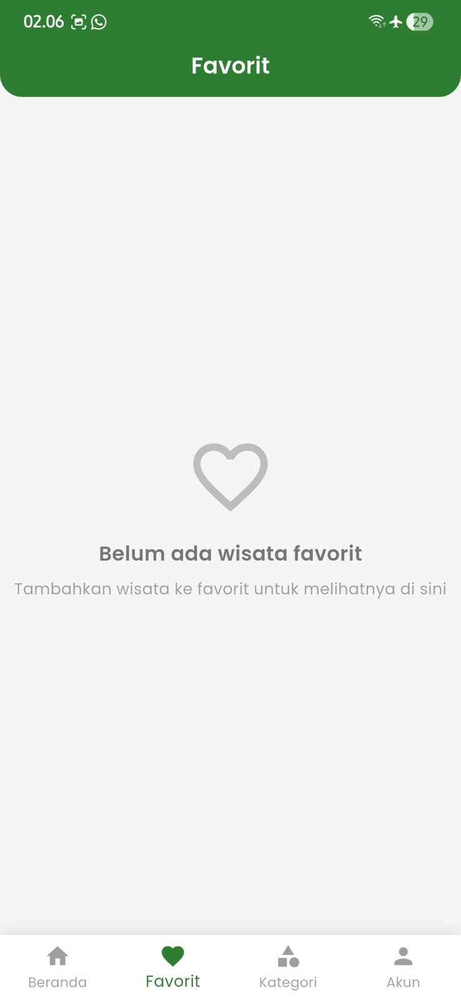
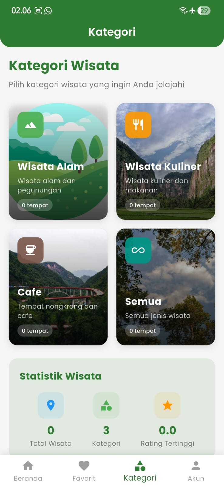
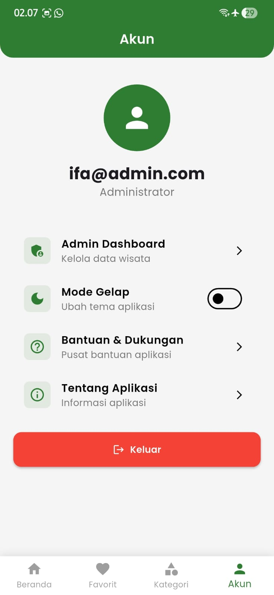
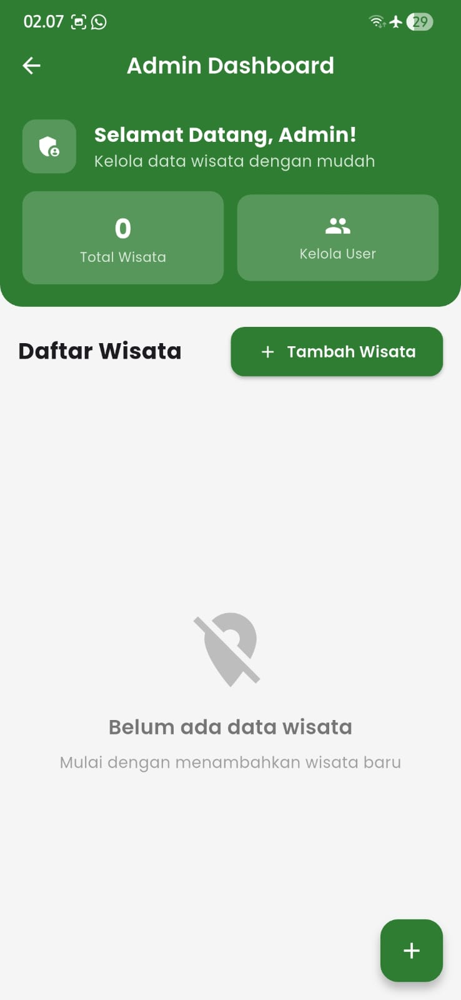
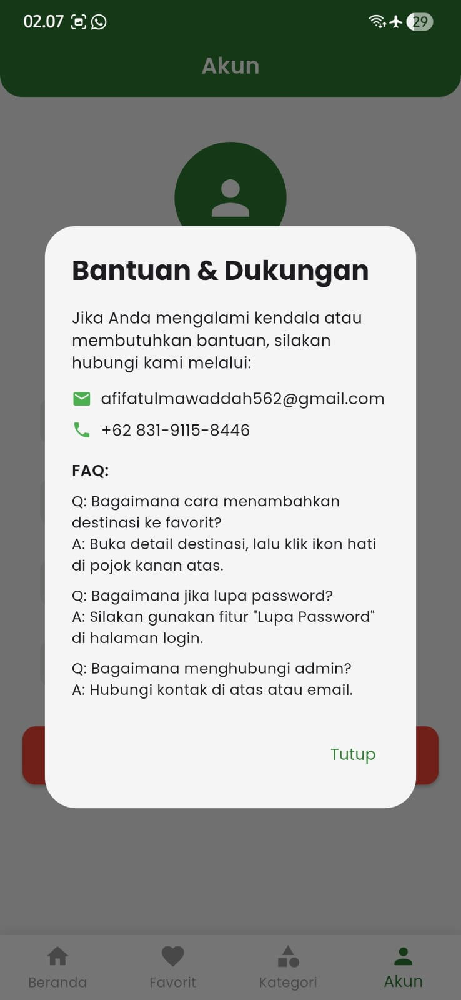
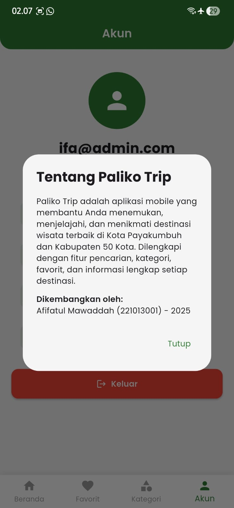

# Paliko Trip - Aplikasi Wisata Payakumbuh

[](https://github.com/afifatul562/PalikoTrip)
[](https://flutter.dev)
[](https://supabase.com)

Paliko Trip adalah aplikasi mobile Flutter yang membantu pengguna menemukan, menjelajahi, dan menikmati destinasi wisata terbaik di Kota Payakumbuh dan Kabupaten 50 Kota, Sumatera Barat.

**Repository**: [https://github.com/afifatul562/PalikoTrip](https://github.com/afifatul562/PalikoTrip)

## 🚀 Fitur Utama

### Untuk User:
- **Pencarian Wisata**: Cari destinasi wisata berdasarkan nama, deskripsi, atau alamat
- **Kategori Wisata**: Jelajahi wisata berdasarkan kategori (Wisata Alam, Kuliner, Cafe)
- **Favorit**: Simpan wisata favorit yang tersimpan di database
- **Detail Wisata**: Informasi lengkap setiap destinasi termasuk rating, ulasan, dan fasilitas
- **Maps Integration**: Buka lokasi wisata di Google Maps melalui url_launcher
- **Dark/Light Mode**: Toggle tema aplikasi sesuai preferensi
- **Notifikasi**: Halaman notifikasi untuk update dan informasi penting
- **Profil User**: Kelola profil pengguna dengan upload foto profil

### Untuk Admin:
- **Dashboard Admin**: Panel khusus untuk mengelola data wisata
- **CRUD Wisata**: Tambah, edit, dan hapus data wisata
- **Manajemen Wisata**: Halaman khusus untuk mengelola semua data wisata
- **Manajemen User**: Kelola data pengguna aplikasi
- **Upload Gambar**: Upload gambar wisata ke Supabase Storage
- **Manajemen Data**: Kelola semua data wisata dengan mudah

## 🛠️ Teknologi yang Digunakan

- **Frontend Framework**: Flutter (SDK ^3.7.2)
- **Backend**: Supabase (PostgreSQL + Auth + Storage)
- **State Management**: Flutter StatefulWidget
- **UI Framework**: Material Design 3
- **Icons**: Material Icons, Cupertino Icons
- **Fonts**: Google Fonts (Poppins)

### Dependencies Utama:
- `supabase_flutter: ^2.0.0` - Backend dan authentication
- `google_fonts: ^6.1.0` - Custom fonts (Poppins)
- `url_launcher: ^6.1.10` - Membuka URL eksternal (Google Maps)
- `image_picker: ^1.0.7` - Memilih gambar dari kamera/galeri
- `cached_network_image: ^3.3.0` - Caching gambar untuk performa
- `lottie: ^3.0.0` - Animasi Lottie
- `shimmer: ^3.0.0` - Shimmer loading effect
- `flutter_staggered_animations: ^1.1.1` - Animasi staggered
- `animated_text_kit: ^4.2.2` - Animasi teks
- `intl: ^0.18.0` - Formatting dan lokalisasi
- `flutter_launcher_icons: ^0.13.1` - Generate app icons

## 📱 Screenshots

### Loading & Welcome

<div align="center">
  
  
</div>

### Main Pages

<div align="center">
  
  
  
  
</div>

### Admin Features

<div align="center">
  
</div>

### Settings & Info

<div align="center">
  
  
  
</div>

## 🚀 Cara Setup

### 1. Prerequisites

- Flutter SDK 3.7.2 atau lebih baru
- Dart SDK
- Android Studio / VS Code dengan Flutter extension
- Git
- Akun Supabase (gratis di [supabase.com](https://supabase.com))

### 2. Clone Repository

```bash
git clone https://github.com/afifatul562/PalikoTrip.git
cd PalikoTrip
```

### 3. Install Dependencies

```bash
flutter pub get
```

### 4. Setup Supabase

1. Buat akun di [Supabase](https://supabase.com)
2. Buat project baru
3. Salin **URL** dan **anon key** dari Settings > API
4. Update konfigurasi di `lib/main.dart`:

```dart
await Supabase.initialize(
  url: 'YOUR_SUPABASE_URL',
  anonKey: 'YOUR_SUPABASE_ANON_KEY',
);
```

### 5. Setup Database dan Policies

#### Opsi 1: Setup Lengkap (Recommended)

1. Buka **SQL Editor** di Supabase Dashboard
2. Buka file `supabase_setup/complete_setup.sql`
3. Copy seluruh isi file tersebut
4. Paste ke SQL Editor dan klik **"Run"**
5. Setup selesai!

#### Opsi 2: Setup Step by Step

Jika ingin setup bertahap, jalankan file-file berikut secara berurutan di SQL Editor:

1. `supabase_setup/01_database_tables.sql` - Membuat tabel database
2. `supabase_setup/02_rls_policies.sql` - Setup Row Level Security
3. `supabase_setup/03_storage_setup.sql` - Setup storage bucket

### 6. Setup Admin User

Setelah setup database selesai:

1. Register user baru melalui aplikasi atau di Supabase Dashboard (Authentication > Users)
2. Jalankan query berikut di SQL Editor untuk memberikan role admin:

```sql
UPDATE user_profiles 
SET role = 'admin' 
WHERE email = 'your-admin-email@example.com';
```

### 7. Verifikasi Setup

Jalankan query berikut untuk memverifikasi setup:

```sql
-- Check policies
SELECT policyname FROM pg_policies WHERE tablename = 'user_profiles';

-- Check storage buckets
SELECT * FROM storage.buckets WHERE id IN ('wisata-images', 'user-uploads');

-- Check tables
SELECT table_name FROM information_schema.tables 
WHERE table_schema = 'public' 
AND table_name IN ('user_profiles', 'wisata', 'user_favorites');
```

### 8. Run Application

```bash
# Run di device/emulator
flutter run

# Run di mode debug
flutter run --debug

# Run di mode release
flutter run --release
```

## 📊 Struktur Database

### Tabel `user_profiles`
- `id`: UUID Primary Key
- `user_id`: UUID (Foreign Key ke auth.users)
- `email`: Email user
- `username`: Username user
- `role`: Role user ('user' atau 'admin')
- `profile_image_url`: URL foto profil
- `created_at`: Timestamp pembuatan
- `updated_at`: Timestamp update

### Tabel `wisata`
- `id`: UUID Primary Key
- `nama`: Nama wisata
- `deskripsi`: Deskripsi wisata
- `alamat`: Alamat wisata
- `image_url`: URL gambar wisata
- `maps_url`: URL Google Maps
- `kategori`: Kategori wisata
- `rating`: Rating (0.0 - 5.0)
- `review_count`: Jumlah ulasan
- `fasilitas`: Array fasilitas (TEXT[])
- `created_at`: Timestamp pembuatan
- `updated_at`: Timestamp update

### Tabel `user_favorites`
- `id`: UUID Primary Key
- `user_id`: UUID (Foreign Key ke auth.users)
- `wisata_id`: UUID (Foreign Key ke wisata)
- `created_at`: Timestamp pembuatan
- **Unique Constraint**: (user_id, wisata_id)

## 🔐 Security

Aplikasi menggunakan **Row Level Security (RLS)** di Supabase untuk keamanan data:

- **User Profiles**: User hanya bisa mengakses dan mengupdate profilnya sendiri
- **Wisata**: Semua user bisa membaca, hanya admin yang bisa CRUD
- **Favorites**: User hanya bisa mengakses dan mengelola favoritnya sendiri
- **Storage**: Upload dan akses file dibatasi berdasarkan role dan ownership

## 📁 Struktur Project

```
lib/
├── main.dart                      # Entry point aplikasi
├── pages/                         # Halaman-halaman aplikasi
│   ├── admin/                    # Halaman admin
│   │   ├── admin_dashboard.dart
│   │   ├── add_wisata_page.dart
│   │   ├── edit_wisata_page.dart
│   │   ├── user_management_page.dart
│   │   └── wisata_management_page.dart
│   ├── home_screen.dart          # Home screen awal
│   ├── login_screen.dart         # Halaman login
│   ├── register_screen.dart      # Halaman registrasi
│   ├── splash_screen.dart        # Splash screen
│   ├── main_navigation.dart      # Bottom navigation utama
│   ├── wisata_list_page.dart     # Daftar wisata
│   ├── detail_wisata_page.dart   # Detail wisata
│   ├── favorit_page.dart         # Halaman favorit
│   ├── kategori_page.dart        # Halaman kategori
│   ├── notifikasi_page.dart      # Halaman notifikasi
│   └── akun_page.dart            # Halaman profil/akun
└── services/                     # Service layer
    ├── auth_service.dart         # Service authentication
    ├── wisata_service.dart       # Service untuk data wisata
    ├── favorit_service.dart      # Service untuk favorit
    └── user_service.dart         # Service untuk user profiles
```

## 🎨 UI/UX Features

- **Material Design 3**: Menggunakan design system terbaru
- **Responsive Design**: Menyesuaikan dengan berbagai ukuran layar
- **Dark/Light Mode**: Tema yang dapat diubah sesuai preferensi
- **Animations**: 
  - Lottie animations untuk splash screen
  - Staggered animations untuk list items
  - Animated text kit untuk efek teks
  - Smooth page transitions
- **Loading States**: 
  - Shimmer effects untuk loading
  - Circular progress indicators
  - Skeleton screens
- **Image Handling**:
  - Cached network images untuk performa
  - Image compression untuk upload
  - Placeholder images
- **Error Handling**: Penanganan error yang user-friendly dengan snackbar dan dialog

## 🔧 Development

### Menambah Fitur Baru

1. Buat service baru di `lib/services/` (jika diperlukan)
2. Buat halaman baru di `lib/pages/`
3. Update navigation di `main_navigation.dart` jika diperlukan
4. Update routing di `main.dart` jika diperlukan
5. Test fitur secara menyeluruh

### Formatting Code

```bash
# Format semua file Dart
flutter format .

# Analyze code
flutter analyze
```

### Debugging

```bash
# Run di mode debug
flutter run --debug

# Run dengan verbose logging
flutter run --verbose

# Hot reload: tekan 'r' di terminal
# Hot restart: tekan 'R' di terminal
# Quit: tekan 'q' di terminal
```

### Build Release

#### Android APK
```bash
# Build APK
flutter build apk --release

# Build App Bundle (untuk Play Store)
flutter build appbundle --release
```

#### iOS
```bash
# Build iOS
flutter build ios --release
```

## 📦 Assets

Assets yang digunakan dalam aplikasi:
- `assets/Logo_Paliko.png` - Logo aplikasi
- `assets/Icon.png` - App icon
- `assets/background.jpg` - Background image
- `assets/forest.png` - Forest image
- `assets/lembah_harau.jpg` - Sample image
- `assets/ngalau_indah.jpg` - Sample image
- `assets/kelok_sembilan.jpg` - Sample image

## 🧪 Testing

```bash
# Run semua tests
flutter test

# Run test dengan coverage
flutter test --coverage
```

## 🤝 Contributing

1. Fork repository
2. Buat feature branch (`git checkout -b feature/AmazingFeature`)
3. Commit changes (`git commit -m 'Add some AmazingFeature'`)
4. Push ke branch (`git push origin feature/AmazingFeature`)
5. Buat Pull Request

## 📄 License

Project ini dilisensikan di bawah MIT License - lihat file [LICENSE](LICENSE) untuk detail.

## 👥 Tim Development

- **Developer**: Afifatul Mawaddah
- **NIM**: 221013001
- **Tahun**: 2025
- **Institusi**: STT Payakumbuh

## 📞 Support & Contact

Jika Anda mengalami kendala atau membutuhkan bantuan:

- **Email**: afifatulmawaddah562@gmail.com

## 🔍 Troubleshooting

### Masalah Umum

1. **Error saat install dependencies**
   ```bash
   flutter clean
   flutter pub get
   ```

2. **Error Supabase connection**
   - Pastikan URL dan anon key sudah benar
   - Cek koneksi internet
   - Verifikasi project Supabase masih aktif

3. **Error upload gambar**
   - Pastikan storage bucket sudah dibuat
   - Cek RLS policies untuk storage
   - Verifikasi permission storage

4. **Error build Android**
   ```bash
   cd android
   ./gradlew clean
   cd ..
   flutter clean
   flutter pub get
   ```

5. **Error build iOS**
   ```bash
   cd ios
   pod deintegrate
   pod install
   cd ..
   flutter clean
   flutter pub get
   ```

## 📝 Changelog

### Version 1.0.0
- Initial release
- Fitur user: Login, Register, Browse Wisata, Favorit
- Fitur admin: Dashboard, CRUD Wisata, User Management
- Dark/Light mode support
- Supabase integration

---

**Paliko Trip** - Jelajahi keindahan Payakumbuh dan 50 Kota! 🏔️✨
